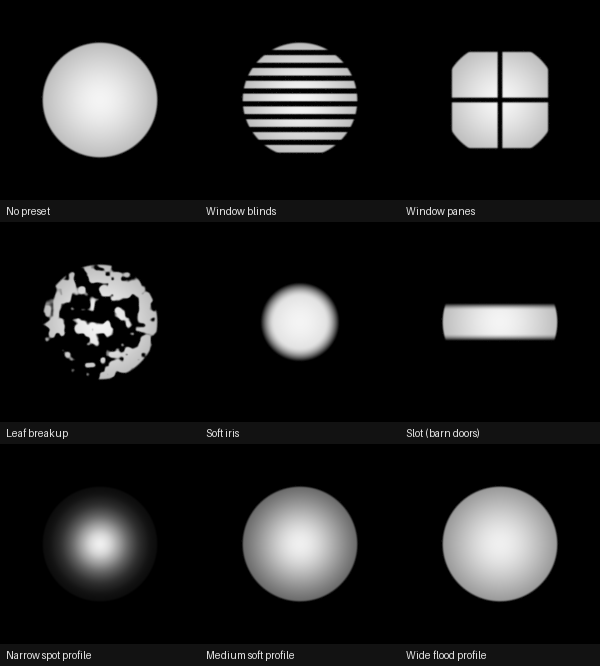
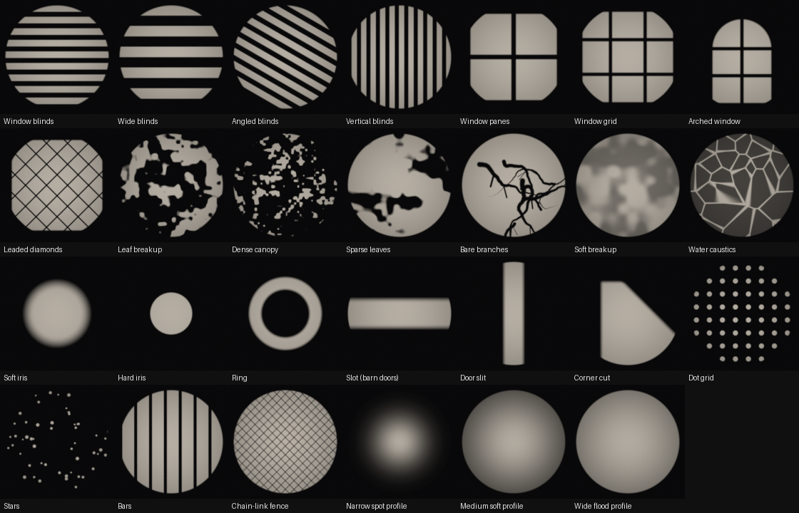
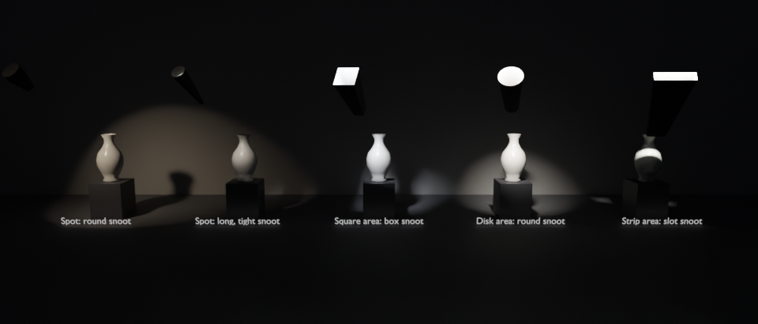
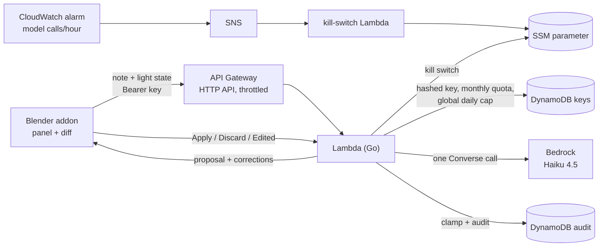

# Thornbury Lighting Assistant

**Demo 7 of the AI workflow portfolio.** A Blender addon plus a Go/AWS backend
that turns a lighting artist's plain-language note ("snoot the key down so it
stops spilling on the background, keep it warm") into proposed settings for
the selected spot or area light, including a **physical snoot**. The artist sees a diff and clicks **Apply** (one
undo step) or **Discard**. Nothing is ever applied automatically.



## Pick by eye: the gobo gallery

Not everyone can describe the look they want, so the panel also has a
**thumbnail picker** that needs no note and no backend call:

- **24 gobos** in four families: windows and blinds, foliage and breakup, shapes and cuts, and graphic patterns. There are also **3 beam profiles (IES)**. All of them are generated by code (`tools/gen_presets.py`), with no AI-generated imagery.
- **Thumbnails are real Cycles renders** of each gobo projected onto a wall through the addon's own node wiring (`tools/render_thumbs.py`). The picker shows what the light will look like, not the raw black-and-white image.
- **Rotate, Size and Offset** sliders reshape the gobo live. A Mapping node in the gobo chain carries these, and gobos from older versions gain the transform the first time a slider moves.
- **Add your own…** turns any image into a gobo, packed into the .blend. The assistant can still swap it for a library gobo.
- Each pick is one undo step and works offline. The notes assistant knows the library too, but only if its backend is deployed from this version.



## Snoots

A snoot here is real geometry, not a shader trick: an open, tapered tube (spot
lights, and disk or ellipse area lights) or box (square or rectangle area
lights) parented to the light, which physically blocks spill in Cycles.
Proportions come from Marian's hand-built examples in `demo/thornbury_demo.blend`:

| | Back opening | Mouth | Length |
|---|---|---|---|
| Spot | 1.08 × light radius | 0.5 × back | 1.0 × back width |
| Area | 1.008 × light size | 0.5 × back | 2.6 × back width |

**It scales with the light.** The snoot's scale is driven by the light's
Radius (spot) or Size/Size Y (area) through simple-expression drivers, which
Blender evaluates even with "auto-run Python scripts" off. Being parented,
it also follows the light's position, rotation and object scale.

- **Length** and **Mouth** rebuild the mesh live.
- **Add Snoot** / **Remove Snoot** are plain tools: no model call, one undo step each.
- **Convert Hand-Built Snoot** measures an existing hand-made snoot and replaces it with a managed one of the same proportions. The original is hidden, not deleted.
- The assistant can add, tighten (smaller mouth or longer tube) or remove a snoot from a note, but never modifies a hand-built one.
- `make render-check` renders the demo scene with and without each snoot and checks the spill is cut.
- Spot snoots have a short collar behind the light's centre. A spot light emits from a sphere, and without the collar light from its back half escaped around the tube (spotted in the showcase render). The visible front shape is unchanged.
- `demo/thornbury_snoot_showcase.blend` (built by `tools/make_snoot_showcase.py`) shows one of each: a spot with a round snoot, a spot with a long, tight snoot, a square area light with a box snoot, a disk area light with a round snoot, and a strip area light with a slot snoot.



## Who it's for

**Thornbury VFX** is a fictional ~110-person boutique animation/VFX studio. In
this scenario it moved its lighting and lookdev pipeline to Blender + Cycles to
keep per-seat licensing costs under control as its episodic workload grew. That
pressure is real across the industry, but this is **illustrative framing, not a
documented case study of a real studio.**

The workflow gap is small and constant: a supervisor gives a verbal note, and a
lighter translates it into numbers (cone angle, blend, power, colour, radius,
maybe a gobo). This tool shortens that translation step. It doesn't make the
lighting decision.

## The one rule: the model proposes instrument settings, nothing else

| Step | Who does it |
|---|---|
| Read the selected light's real values from `bpy` | **Code** (addon) |
| Turn the note into proposed values | **Model**: one bounded Bedrock call (Claude Haiku 4.5, text only, 400 output tokens, temperature 0, forced tool call so the answer is always structured JSON) |
| Convert units, validate, clamp to Blender's real ranges and our policy limits, drop invented presets, report every correction | **Code** (Go, `internal/lightparams`) |
| Show the diff, let the artist untick or edit rows | **Code** (addon) |
| Write the values, one undo step | **Code**, only when the artist clicks Apply |
| Keys, quotas, kill switch, audit log | **Code** |

The model never moves, aims or rotates a light, and never touches the camera,
composition or other objects. It never judges whether the shot looks good,
and it never generates an image. Placement or taste notes come back as "out of
scope" with no changes. Confidence measures how sure it is **which settings
the note refers to**, not how good the result will look.

## How it fits together



API: `GET /v1/health`, `GET /v1/me` (usage; no model call),
`POST /v1/suggest`, `POST /v1/outcome`.

## Guardrails

- **Keys are stored as SHA-256 hashes only.** The plaintext is printed once by
  `issue-key`. Keys carry 256 bits of randomness.
- **Per-key monthly cap** (default 50), enforced atomically in DynamoDB.
  30 concurrent requests against a limit of 10 reserve exactly 10 (tested on
  DynamoDB emulation).
- **Global daily cap** (300 model-call attempts per day, a template parameter;
  failed calls count too, and 0 turns the assistant off) plus API Gateway
  throttling (5 req/s, burst 10).
- **Kill switch:** an SSM parameter created by the template (fails closed and
  is cached 30 s). `tla-admin pause`/`resume` flip it. A CloudWatch alarm on
  model calls per hour (default 120) turns it off automatically.
- **Billing alarm** in us-east-1 (`make billing-alarm`).
- **Bounded cost per call:** the note is limited to 500 characters, the
  response to 400 tokens, and there's one call per request. That's roughly
  $0.003 per suggestion at Haiku 4.5 prices, so a 50-call tester month costs
  about $0.15.
- **Failed model calls:** a failure that can't have been billed (no tokens
  reported, no timeout) is refunded to the tester's key. Billed failures
  still count, so a note that reliably breaks the model can't be replayed for
  free. Either way the call is audited as `model_error`. Invalid requests are
  rejected before any charge or model call; rejections are logged to
  CloudWatch.
- **Audit trail:** note, current values, raw model output, clamped proposal,
  corrections, rationale, confidence, tokens, latency, and the outcome
  (applied / discarded / edited, with the values actually applied). Kept 180
  days.
- **Addon side:** nothing is written until Apply, and Apply is all or
  nothing: every check and file load happens before the first write, and a
  failure rolls every value back. A result that arrives after Cancel, or
  after a new Suggest or a file load, is ignored. The key is only ever sent
  over https (or plain http to this machine for local testing).

## Install the plugin

Download or build the zip (`make addon-zip` → `dist/thornbury_lighting-0.3.1.zip`),
then in Blender 4.2+: **Edit > Preferences > Add-ons > ⌄ > Install from Disk…**.
Snoots, gobos and beam profiles work straight away. No account, key or internet
is needed.

## Host your own backend (optional, for the notes assistant)

The Lighting Note Assistant needs a small backend in your own AWS account.
One command deploys it and prints the Backend URL and API key for the
plugin's preferences:

```bash
make self-host                                   # or: make self-host PROFILE=my-profile REGION=eu-west-1
```

See **[docs/self-host.md](docs/self-host.md)** for what you need, what it
costs, the built-in limits, and how to remove it (`make self-host-delete`).

## Maintainer notes (the Thornbury demo deployment)

Marian's own stack uses the AWS profile `demos-admin` in us-west-2. Put
`PROFILE = demos-admin` in `local.mk`, or `export AWS_PROFILE=demos-admin`.

```bash
make test && make sam-deploy
make issue-key LABEL=boyfriend-tester LIMIT=50   # prints the backend URL + key ONCE
make addon-zip
make billing-alarm EMAIL=you@example.com         # optional; us-east-1
```

Send a tester the zip, `docs/tester-guide.md`, `demo/thornbury_snoot_showcase.blend`,
and the two lines `issue-key` printed. Day to day, `go run ./cmd/tla-admin keys | audit --n 20 |
pause | resume | status | revoke --id <id> | set-limit --id <id> --limit <n>`.

## Try it locally first (no AWS)

```bash
make local            # API on http://127.0.0.1:8787 with the mock model; prints a key
```

Install the zip in Blender, paste `http://127.0.0.1:8787` and the printed key,
and the whole loop works. The **mock model** is a keyword matcher that labels
itself "Mock model:" in its rationale. `make local-bedrock` runs the same
server against real Bedrock with your AWS profile. The local audit trail is at
`http://127.0.0.1:8787/local/audit`.

## Testing

- `make test`: Go unit and handler tests with the race detector, covering:
  - clamping against Blender's real ranges;
  - hostile model output (720° cones, 1e9 W, invented presets, 1,000-word rationales);
  - quota, revocation, kill switch and global cap;
  - refunds on model failure, outcome ownership and idempotency.
  
  Set `DYNAMO_TEST_ENDPOINT` (e.g. `moto_server`) to run the store contract
  against DynamoDB semantics as well.
- `make addon-test`: installs the built zip the way **Install from Disk**
  does, into a throwaway Blender profile, then runs 26 tests inside real
  Blender. It covers:
  - reading and writing the data-block, and client-side clamps;
  - temperature capability, gobo and IES wiring, preset switching and removal;
  - custom node trees are never touched, unticked and edited rows, the operator's UNDO flag;
  - the offline refusal;
  - regression tests for everything the independent review found (stale results, a stuck "Asking…", partial applies, the URL check);
  - an end-to-end Suggest → Apply → outcome-in-audit run against `cmd/local`.
  
  Set up the Blender builds once:
  ```bash
  python3.11 -m venv .venvs/bpy-4.2 && .venvs/bpy-4.2/bin/pip install bpy==4.2.0
  python3.13 -m venv .venvs/bpy-5.2 && .venvs/bpy-5.2/bin/pip install bpy==5.2.2 pillow
  ```
- `make render-check`: renders every preset in Cycles and checks it has the
  intended effect, including that IES presets keep the light's exposure.
- Verified on 2026-09-24 against **Blender 4.2.0, 4.5.14 LTS, 5.0.1, 5.1.2 and
  5.2.2 LTS**. See [docs/blender-api-verification.md](docs/blender-api-verification.md).
  Not automated: a real Ctrl+Z in the UI (headless Blender has no undo).

## Repo layout

```
addon/thornbury_lighting/   the Blender extension (manifest, panel, operators, presets)
addon/tests/                tests that run inside real Blender builds
cmd/api                     Lambda binary (HTTP API; HANDLER=killswitch for the alarm target)
cmd/local                   local server (in-memory store, mock or Bedrock model)
cmd/issue-key               mint a tester key (hash stored, plaintext shown once)
cmd/tla-admin               keys, limits, audit, kill switch
internal/lightparams        Blender ranges, clamping, no-op dropping, kelvin→RGB
internal/propose            prompt, tool schema, Bedrock call, mock, interpretation
internal/store              DynamoDB + in-memory stores (same contract tests)
internal/api                handlers + API Gateway adapter
internal/presets            embedded preset library (same file ships in the addon)
infra/                      SAM template, billing alarm
tools/                      preset generator, zip builder, render checks, demo scene
demo/thornbury_demo.blend   Marian's scene with hand-built spot and area snoots (saved in 5.2; opens in 4.5+)
demo/thornbury_snoot_showcase.blend  five vases, five lights, five managed snoots (opens in 4.2+)
docs/                       API verification, tester guide, images
```

## Licences

This repo holds two separately licensed parts that only talk to each other
over HTTP:

- **The Blender plugin** (`addon/`, including the generated gobo images and
  IES profiles) and the scripts that drive Blender's Python API (`addon/tests/`,
  and `tools/render_*.py` and `tools/make_*.py`) are
  **GPL-3.0-or-later**, as Blender requires for code that uses its Python API.
  See [addon/thornbury_lighting/LICENSE](addon/thornbury_lighting/LICENSE).
- **Everything else** (the Go backend, CLIs, infrastructure templates, docs and
  the other tools) is **Apache-2.0**. See [LICENSE](LICENSE).

Copyright 2026 Marian Montagnino.
